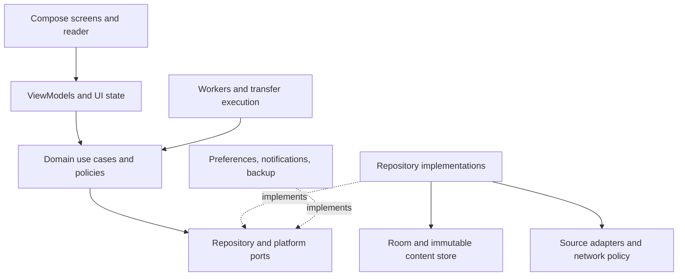
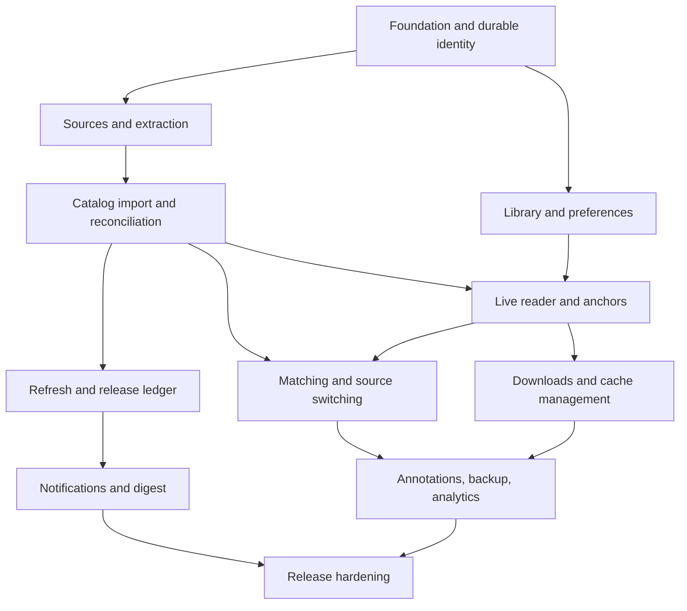
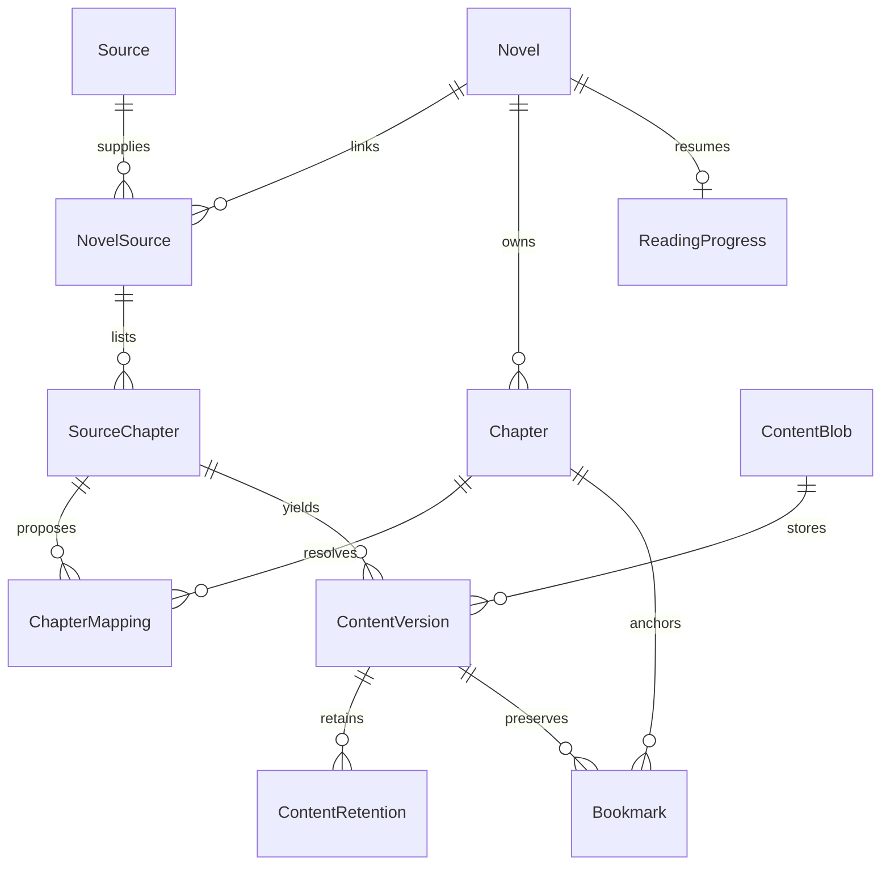

# NovelVerse — Architecture and Delivery Blueprint

Status: proposed design for approval • 8 October 2026 • Revision 1

Planning only. No application code, repository, source integration, build, or test result is represented as completed. The accessible GitHub repository search for NovelVerse returned no matches. Repository selection can happen after architecture approval.

## 1. Recommended system architecture

Build a native Android, offline-first modular application. Use Kotlin, Compose/Material 3, ViewModel, Coroutines/Flow, Hilt, Room, OkHttp, Jsoup, WorkManager, DataStore, Coil, and Navigation Compose. Add Paging for large local lists, Kotlin serialization for versioned data contracts, and controlled HTTP fixtures for adapter tests. Pin compatible stable versions during Phase 1 rather than guessing versions in this plan.

Propose Android 8/API 26 as the minimum supported platform, subject to the desired device audience. Choose compile/target SDK and distribution requirements at implementation and recheck before release. Core functions require no backend or account. Keep domain policies in pure Kotlin without Android, Room, Jsoup, or Compose types; platform implementations satisfy ports. This supports future reuse but does not promise a cost-free multiplatform conversion.

The central invariant is that **novel identity, chapter identity, source listings, and content versions are different records**. A domain change, parser repair, or source deletion must not change canonical IDs or destroy user data.



Read UI state from local repositories. Network results enter local storage before becoming durable UI state; search previews can remain transient until imported. A live chapter is stored in the temporary content cache, not marked downloaded. Immutable UI state exposes loading, stale data, recoverable errors, and capability limitations explicitly. Use structured concurrency, injected dispatchers/clocks, and cancellable operations. Reader requests take priority over prefetch, downloads, and refresh work.

### Proposed modules

| Module | Responsibility and boundary |
|---|---|
| `:app` | Application composition, Hilt wiring, navigation, deep links, lifecycle |
| `:core:model` | IDs, immutable domain objects, typed errors; pure Kotlin |
| `:core:domain` | Repository ports, matching, fallback, quality, scheduling policies; pure Kotlin |
| `:core:database` | Room entities, DAOs, projections, transactions, migrations |
| `:core:network` | OkHttp transport, redirect/host policy, rate limiting, request budgets |
| `:core:sources` | Declarative adapter validation, Jsoup extraction, capability registry |
| `:core:content` | Normalized blocks, content hashes, atomic storage, leases and eviction |
| `:core:data` | Repository implementations joining database, adapters, and content store |
| `:core:preferences` | Versioned DataStore preferences and scoped overrides |
| `:core:designsystem` | Themes, typography, reusable accessible controls |
| `:core:testing` | Fixture adapters, clocks, builders, controlled web responses |
| `:feature:library`, `:feature:explore`, `:feature:details` | Collection, source/search workflows, chapter catalogs |
| `:feature:reader` | Rendering, session state, controls, anchors, source-switch review |
| `:feature:downloads`, `:feature:updates` | Transfer management and release history |
| `:feature:settings`, `:feature:backup` | Preferences, diagnostics, import/export/restore |
| `:background` | WorkManager orchestration and notification delivery adapters |

Feature modules do not access DAOs or OkHttp directly and do not depend on each other's internals. Navigation carries IDs, not full novels or chapter text. Avoid creating a Gradle module for every small class; the boundaries above can begin as packages where build complexity outweighs isolation.

### Decisions and trade-offs

| Decision | Benefit | Cost / mitigation |
|---|---|---|
| Native text reader, not a website wrapper | Predictable typography, offline rendering, accessibility | Pagination and cross-block selection need an early feasibility milestone |
| Room metadata + immutable block content files | Indexed catalogs and bounded reading memory | Files and database need an explicit crash-recovery protocol |
| Declarative source configurations | Editable without arbitrary executable plugins | Cannot support every website; report unsupported capabilities |
| Conservative chapter matching | Avoids wrong-chapter substitutions | Requires review for ambiguous catalogs |
| Chunked durable background tasks | Resume after process loss and cooperate with OS limits | Background completion is not immediate or exact |
| Internal storage by default | Reliable atomic file operations | Uninstall removes local app data; user-exported backups are needed |
| DataStore global preferences; Room relational overrides | Clear ownership and queryable scheduling | Restore coordinates two stores through a recovery journal |

## 2. Feature dependency map



Security policy, accessibility, diagnostic redaction, schema exports, and automated checks start in Phase 1. Hardening is a final evidence gate, not the first time these concerns are addressed. Persistent progress precedes source switching; immutable content versions precede annotation editing and replacement; release reconciliation precedes notifications.

## 3. Database design

Use opaque UUIDs generated locally for durable entities. URLs and numeric chapter labels are attributes, never primary identity. Persist UTC instants; store quiet-hour timezone and local reading-day timezone separately. Decimal chapter labels use text or decimal-safe components, never floating-point equality.

### Canonical and source tables

| Table | Important fields | Keys and rules |
|---|---|---|
| `Novel` | id, title, author, description, coverAssetId, language, publicationStatus, readingStatus, inLibrary, createdAt, updatedAt | PK id; manual novels may have no sources; title is not unique |
| `NovelAlias` | novelId, title, normalizedTitle, locale | Unique novelId + normalizedTitle + locale |
| `Source` | id, name, language, adapterType, enabled, priority, currentDefinitionVersion | Stable ID independent of domain; deletion is disable/archive initially |
| `SourceDefinition` | sourceId, version, schemaVersion, configuration, checksum, createdAt | Unique sourceId + version; preserve prior definitions for repair |
| `SourceOrigin` | sourceId, origin, active, userApprovedAt | Unique sourceId + origin; domain changes require validation |
| `NovelSource` | id, novelId, sourceId, sourceNovelIdentifier, relativePath, sourceTitle, priority, enabled, lastAttemptAt, lastSuccessAt | Unique sourceId + sourceNovelIdentifier when stable; otherwise unique sourceId + normalized URL identity |
| `Chapter` | id, novelId, normalizedTitle, numberText, volumeKey, chapterType, canonicalOrder, createdAt, updatedAt | Index novelId + canonicalOrder + id; number/title not unique |
| `SourceChapter` | id, novelSourceId, providerIdentifier, relativePath, sourceTitle, sourceOrder, volumeHint, firstSeenAt, lastSeenAt, availability | Unique novelSourceId + providerIdentifier; stable URL-derived identity only where provider lacks IDs |
| `ChapterMapping` | sourceChapterId, chapterId, state, confidence, method, algorithmVersion, confirmedAt | One confirmed mapping per source chapter in initial one-to-one model; proposals can remain unconfirmed |
| `MappingCandidate` | sourceChapterId, candidateChapterId, evidence, score | Unique pair; explicitly unresolved until safe or confirmed |
| `CatalogSnapshot` | id, novelSourceId, fetchedAt, validator, definitionVersion, complete, fingerprint | Snapshot completeness recorded; never infer deletion from a failed/partial crawl |
| `CatalogEntry` | snapshotId, sourceChapterId, title, ordinal, metadataHash | Unique snapshotId + sourceChapterId; indexed sourceChapterId |

`SourceChapter` plus `ChapterMapping` refines the proposed `ChapterSource` entity: a website listing must exist before its canonical match is known. This prevents forced false matches. If a source splits one canonical chapter into multiple separate listings or combines chapters, mark the mapping unsupported/needs review in the first release. Paginated continuation within one listing is supported separately. Do not pretend one-to-one matching solves every catalog format.

### Content, progress, and annotations

| Table | Important fields | Keys and rules |
|---|---|---|
| `ContentVersion` | id, sourceChapterId, blobHash, formatVersion, definitionVersion, fetchedAt, characterCount, paragraphCount, qualityFlags, remoteValidator | Immutable provenance; unique sourceChapterId + blobHash + formatVersion |
| `ContentBlob` | hash, relativeLocation, byteSize, integrityState, createdAt | Deduplicated immutable payload; location may be absent after eviction |
| `ContentRetention` | versionId, reason, ownerId, createdAt | Reasons include OFFLINE, CACHE, ANNOTATION; unique version + reason + owner |
| `ReadingProgress` | novelId, chapterId, contentVersionId, blockId, characterOffset, quote, prefix, suffix, relativeProgress, updatedAt | PK novelId; exact anchor plus fallback; progress fraction constrained 0–1 |
| `ChapterReadState` | chapterId, completed, completedAt, lastVisitedAt | PK chapterId; completion separate from latest reader position |
| `Bookmark` | id, novelId, chapterId, versionId, anchor, note, createdAt | Annotation anchor remains associated with original version |
| `Highlight` | id, novelId, chapterId, versionId, startAnchor, endAnchor, color, note, createdAt | Old version retained or explicitly archived when replacing content |
| `NovelSourcePolicy` | novelId, primaryNovelSourceId, autoFallback, preferOffline | Preferred link must belong to same novel |
| `ChapterSourceOverride` | chapterId, novelSourceId | Explicit chapter selection; validate link belongs to chapter's novel |
| `SourcePolicyBoundary` | id, novelId, startChapterId, novelSourceId, createdAt | “From here onward” anchored to stable chapter ID, not raw chapter number |

Reading percentages and unread counts are projections, not identity. Overall progress can change when new chapters arrive; display read/available counts and do not use overall percentage as the sole restoration anchor. Provisional source entries do not inflate confirmed release counts.

### Operations and user organization

| Table | Purpose and essential constraints |
|---|---|
| `Collection`, `NovelCollection`, `Tag`, `NovelTag` | Many-to-many shelves/tags; unique join pairs; separate manual ordering |
| `DownloadBatch`, `DownloadTask` | Durable requested scope and per-chapter status, resolved source/version, attempts, nextAttemptAt, leaseOwner, leaseExpiresAt, error code; prevent duplicate active equivalent requests |
| `RefreshPolicy` | Global/default and per-novel override; tracking policy, interval, network/battery conditions, paused status |
| `RefreshTarget` | NovelSource eligibility, nextDueAt, lastAttemptAt, lastSuccessAt, lease and retry state; indexed due time |
| `SourceHealth` | Recent failures, category, blockedUntil, lastSuccess; bounded history and cooldown |
| `UpdateHistory` | Per-check outcome and counts; errors do not masquerade as zero updates |
| `ReleaseEvent` | novelId, chapterId, eventType, discoveredAt; unique chapterId + new-release event type |
| `NotificationOutbox`, `NotificationHistory` | Stable delivery/deduplication key, pending/delivered state, suppression reason, deep-link target |
| `ReadingSession` | Optional local active-reading duration and timezone; idle/background excluded |
| `SearchHistory` | Optional local searches, source scope, timestamp; user-clearable |
| `RestoreJournal`, `DiagnosticEvent` | Resumable restore state; bounded redacted technical diagnostics |

Global appearance and reader defaults live in DataStore. Relational collections, schedules, per-novel settings, and progress live in Room. Store secrets in a separate platform-protected credential facility, referenced by opaque IDs; never put cookies or passwords in adapter JSON.



### Integrity, query design, and migrations

Enable foreign keys. Enforce same-novel relationships with composite unique keys/foreign keys where possible and transactional validation otherwise. Use RESTRICT for durable chapter/content/annotation references, CASCADE only for expendable join or staging rows, and explicit deletion services for user-owned data. Removing a novel from Library sets `inLibrary=false`; a separate reviewed purge lists downloads and annotations affected. Unlinking a source archives the association while provenance remains referenced.

Index every frequent foreign-key lookup, chapter ordering, unread/download filters, task state/next-attempt, and due refresh targets. Page Library and chapter lists using indexed queries; use bounded projections rather than per-row database requests. Add a compatible SQLite FTS index for title/catalog search after measured need; text search inside a chapter reads bounded content blocks.

Export Room schemas into version control from v1. Require migration paths from every shipped schema to the latest, fixture validation of rows and foreign keys, and process-interruption recovery tests for file format migrations. Use automatic migrations only for supported structural changes; write explicit migrations for semantic changes. Never enable destructive fallback in production. A failed migration enters recovery/export guidance without deleting the database. App downgrade is not guaranteed; reject unsupported newer schemas safely. Version database, source schema, normalized content format, and backup schema independently. [R4]

## 4. Source-adapter contract and definition design

An adapter performs bounded, authorized retrieval through a policy-controlled transport. It never owns user progress or canonical identity and cannot access arbitrary files, application credentials, or native APIs.

| Contract operation | Input | Output |
|---|---|---|
| `capabilities` | Validated definition | Search, metadata, catalog, chapter, dates, pagination, rendering requirements |
| `validate` | Explicit test page / source definition | Connectivity plus field-by-field extraction diagnostics; not merely HTTP 200 |
| `search` | Query, cursor, cancellation | Page of source novel references with metadata and provenance |
| `fetchNovel` | Source novel reference | Source metadata, optional cover/genres, extraction diagnostics |
| `fetchCatalog` | Source novel reference, cursor, validators | Bounded catalog page, continuation, completeness state |
| `fetchChapter` | Source chapter reference, validators | Normalized blocks, provenance, quality signals, continuation status |
| `checkUpdates` | Catalog reference and last validators | Changed/unchanged/unsupported; falls back to catalog comparison |

Return typed results: success, not-modified, unsupported capability, offline, timeout, rate-limited with retry time, access-denied, authentication-required, parser-changed, missing-content, unsupported-rendering, and policy-blocked. User cancellation propagates as cancellation, never as a retryable failure. Provider observations remain distinct from inferred quality warnings.

### Declarative schema proposal

The following is a design example using a reserved `.example` host. It is not an installed or tested website integration, executable code, or a claim that these selectors work on a real site.

```json
{
  "schemaVersion": 1,
  "id": "example-public-fiction",
  "name": "Example Public Fiction",
  "allowedOrigins": ["https://fiction.example"],
  "baseUrl": "https://fiction.example",
  "language": "en",
  "adapterType": "css-html-v1",
  "capabilities": ["search", "metadata", "catalog", "chapter"],
  "request": {
    "timeoutSeconds": 20,
    "maxResponseBytes": 2097152,
    "minIntervalMillis": 2000,
    "maxConcurrentRequests": 1,
    "headers": {"Accept": "text/html"},
    "encoding": "auto"
  },
  "search": {
    "path": "/search",
    "queryParameter": "q",
    "itemSelector": "article.book",
    "titleSelector": "h2",
    "urlSelector": "h2 a",
    "urlAttribute": "href",
    "authorSelector": ".author",
    "coverSelector": "img",
    "coverAttribute": "src",
    "nextPageSelector": "a.next"
  },
  "novel": {
    "titleSelector": "h1",
    "authorSelector": ".author",
    "descriptionSelector": ".synopsis",
    "coverSelector": ".cover img",
    "coverAttribute": "src",
    "genreSelector": ".genres a"
  },
  "catalog": {
    "itemSelector": "ol.chapters li",
    "titleSelector": "a",
    "urlSelector": "a",
    "urlAttribute": "href",
    "nextPageSelector": "a.catalog-next",
    "order": "ascending"
  },
  "chapter": {
    "titleSelector": "h1",
    "contentSelector": "article.chapter-body",
    "removeSelectors": [".navigation", ".advertisement"],
    "continuationSelector": "a.chapter-continuation",
    "maxContinuationPages": 10
  }
}
```

Validation requires supported schema/version, mandatory selectors for advertised capabilities, bounded string/config sizes, compilable selectors, valid HTTPS URLs, approved origins, allowed header names, pagination limits, and non-executable extraction rules. The schema also permits optional provider ID/date extraction and fixed encoding overrides. Unknown capabilities are rejected or shown unsupported, not silently enabled. A compatible connector means this explicitly documented schema; arbitrary third-party extension formats are not assumed compatible.

Encode queries as parameters rather than concatenating raw user text. Resolve relative URLs against the effective approved base. Revalidate every redirect and destination; block local/private/link-local and non-HTTP destinations for downloaded definitions, with a separate developer-only fixture policy. Host restrictions apply to covers and continuations too. Cap decompressed bytes, redirects, DOM size, pagination count, and total operation time. Disallow untrusted authorization/cookie/host header injection. Use per-source cookie isolation, explicit user sessions when supported, and no credential forwarding across domain changes. Render sanitized text, never execute source HTML in the reader.

Use a source-origin-wide limiter shared by search, reader, downloads, and updates; source aliases must not multiply request allowance. Respect Retry-After and site policies; do not retry authorization failures or access challenges automatically. Timeout/5xx retries use bounded exponential backoff with jitter. User-selected concurrency cannot exceed source policy.

Follow known pagination until complete, visited URL detection, or a safety cap. A cap or broken continuation marks content/catalog partial and prevents confident deletion or completeness conclusions. Do not silently strip legitimate repeated prose or translator notes merely because they look unusual; adapter-specific cleanup is previewable.

Browser-assisted import initially accepts an explicitly shared URL and extracts with a compatible adapter. It does not imply support for arbitrary websites. JavaScript rendering is a separately gated adapter capability: isolated WebView state, no JavaScript bridge or file access, tightly bounded origins/resources/time, explicit permission, and security review. Default release scope rejects unsupported JavaScript pages clearly. No DRM, CAPTCHA, paywall, or access-control bypass.

Source-test UI shows HTTP/policy outcome, resolved URL, each extracted field, catalog sample, normalized chapter preview, missing fields, pagination completeness, and definition version. Saving an untested draft is allowed but clearly marked; enabling claimed functionality requires successful validation.

## 5. Identity, matching, and source selection

### Novel linking

Search selected sources with bounded fan-out. Group potential duplicates for presentation using normalized title/aliases, author, language, and catalog evidence. Similar titles alone never cause a merge. Import results as one canonical novel only after a high-evidence known link or explicit user confirmation. A manual library novel can later acquire its first source without changing its ID.

### Chapter reconciliation algorithm

1. Preserve raw labels and provider IDs. Parse normalized Unicode title, optional volume, decimal-safe number, type (main/prologue/interlude/side story), and descriptive title tokens. Locale-specific parsers are versioned.
2. Within an existing source, use stable provider IDs first. A changed title/order on the same provider entry updates observations, not canonical identity. URL changes without stable IDs require evidence and review.
3. Between linked sources, generate a bounded candidate window from confirmed neighbors, chapter type, volume, order, and title. Numbers narrow candidates but never prove identity.
4. Score multiple independent signals; record conflicts and evidence. Reject conflicting volumes/types. Use monotonic sequence alignment between confirmed anchors to reduce false shifts while permitting missing chapters.
5. Confirm automatically only under a conservatively validated rule with no ambiguity and a sufficient margin over the next candidate. Thresholds are calibrated against labeled fixtures; no arbitrary score is presented as statistical confidence.
6. Keep ambiguous, split/combined, or conflicting entries unresolved. Show side-by-side context for user review. Persist manual mappings with provenance and protect them from automatic replacement.
7. Create new canonical chapters from a trusted complete first catalog. For later catalogs, create confirmed new entries only after reconciliation distinguishes them from renamed/reordered/existing chapters. Hold uncertain new candidates for review.

Catalog removals change availability, never delete canonical chapters or downloaded content. A revised text creates a new content version, not a new chapter-release event. A second source exposing an existing chapter adds availability. A source domain change preserves the source ID; it requires origin approval and connectivity/parser validation before relative paths are reused. Signed or source-specific absolute URLs are re-resolved rather than blindly rewritten.

### Source resolution order

Resolve explicit user selection, chapter override, most recent applicable “from here onward” boundary, novel primary source, then configured fallback order. Among authorized candidates, prefer usable downloaded content when the setting requests it. An explicit user source selection takes precedence over automatic offline preference; explain when that selected version is unavailable offline.

Only confirmed chapter mappings qualify for automatic fallback. Skip disabled, policy-blocked, missing, or cooldown sources. Automatic failure fallback is opt-in; quality warnings alone do not silently replace content. A major content discrepancy or uncertain mapping opens review. If a boundary chapter cannot be ordered after catalog repair, pause that boundary and ask for review rather than guessing.

Fetch a proposed replacement alongside the current version, evaluate it, map the anchor, and only then commit the reader session to the replacement. If retrieval fails, the current content and position remain visible. “This chapter only” persists a chapter override; “From here onward” creates a boundary; “Make primary” updates the novel policy. Explain existing chapter overrides and allow clearing them separately.

### Content quality

Emit independent heuristic flags: missing container, empty body, unusually short relative to a robust local baseline, high repeated-block ratio, known boilerplate, heading-only content, failed continuation, and cross-source size discrepancy. Abrupt-ending checks are low-confidence and language dependent. Do not collapse these into a claim of completeness or rank versions solely by length.

Comparison shows source, title, characters, paragraphs, fetched time, continuation state, flags, and offline status. Retry produces a candidate version. Explicit replacement preserves old annotated versions; ignored warnings are scoped to a version so new extraction problems remain visible.

## 6. Reader rendering and state preservation

Normalize source HTML into versioned blocks: heading, paragraph, emphasis spans, simple lists, scene break, and supported image/alt text. Retain meaningful structure; exclude scripts and irrelevant source chrome. Use a deterministic block hash plus occurrence context for intra-version identity. Blocks do not claim stable identity across revised prose.

The reader session holds canonical chapter ID, selected source/version, text anchor, mode, layout settings, toolbar state, and transition policy. Persist meaningful movement with a short debounce, flush at chapter/source/mode changes and lifecycle boundaries, and keep transient UI state in SavedStateHandle. Force-kill may lose movement since the last committed checkpoint; validate and document the bounded loss rather than claiming every pixel is crash-proof.

### Anchor restoration

Store block identity, character offset, exact short text quote with prefix/suffix, content version, and fractional chapter progress. Restoration order is exact version/block → unique contextual quote match → nearby matched block → relative chapter position. Never silently attach an annotation to an ambiguous quote. Source switching may be approximate; show a subtle notice when fallback occurred. Annotations remain anchored to their original version until a proposed remap is confirmed.

### Continuous mode

Use a lazy block list with stable version/block keys and a bounded active window, initially previous/current/next chapter. Choose active chapter from a defined viewport reading anchor rather than whichever chapter happens to load. Preserve viewport position when trimming old blocks or inserting earlier content. Load ahead into the temporary cache; insert content at a stable end boundary without changing existing block heights. If unavailable, show an inline retry/load-next boundary. Preserve fixed image aspect ratio where known. Split exceptionally long paragraphs into layout chunks at safe text boundaries while retaining logical text offsets and selection mapping.

### Paginated mode

Use the same blocks and anchor model. Measure text with the actual resolved font, font scale, viewport, insets, language, line spacing, and layout direction; form page boundaries at measured line breaks. Never paginate by fixed character count. Cache bounded page layouts keyed by content hash plus layout fingerprint. Measure visible and nearby pages incrementally; after typography/rotation changes reflow around the saved anchor. Exact total page count may remain pending until measured—show chapter percentage rather than inventing a total. Compose TextMeasurer has an input-sensitive layout cache, so font/width changes invalidate relevant results. [R3]

Use a pager for horizontal page transitions; final/first-page gestures cross chapters only under the user's transition preference. Buttons always mean chapter navigation. Instant/slide are first; fade follows accessibility verification. Page curl remains optional and cannot gate release. Text layout threading depends on the selected API: benchmark and keep main-thread work small, using background-safe layout calculation where supported. Do not assume every Compose text API can be invoked on arbitrary workers.

### Controls and accessibility

Center tap reveals tools without stealing text selection; tap-zone and volume navigation are optional. Disable competing tap gestures while selecting. Support font size/weight, line/letter/paragraph spacing, margins, alignment, indentation, theme, brightness override and keep-awake scoped to the active reader. Restore system brightness/window settings on exit. Use logical start/end alignment, scalable fonts, 48dp touch targets, labeled actions, high contrast, and TalkBack reading order. Provide visible chapter actions for users unable to gesture. Respect reduced motion and avoid gesture conflicts with system navigation.

Selection across lazily rendered blocks/pages is an explicit engineering spike and acceptance gate. Reuse native text semantics where possible; introduce a selection coordinator or an Android text component integration if Compose selection cannot meet correctness/accessibility requirements. Search/highlight offsets refer to the normalized logical document, not page numbers. TTS operates on the same blocks, updates a speech anchor, respects audio focus/lifecycle, and never makes auto-reading a hidden default.

## 7. Screen and navigation specifications

Keep four bottom destinations: Library, Explore, Downloads, Settings. Each retains list/scroll/filter state. Reader is a separate full-screen route without the bottom bar. Back returns to the prior details/catalog/list context. Compact phones use bottom navigation; larger layouts can use a rail without changing destinations. Use ID-based internal routes; external links are validated and cannot trigger silent network retrieval.

| Screen | Layout and primary actions | Required states and behavior |
|---|---|---|
| Library | Toolbar: search/filter, refresh, Updates; compact Continue section; shelf tabs; grid/list | Empty → Explore/Add manually; stale data stays visible during refresh; badges derive from confirmed data |
| Explore | Search field, selected source(s), installed source cards, Manage Sources | No source → Add source; unsupported search shown explicitly; per-source failures do not hide other results |
| Search results | Cover/title/author/excerpt, source attribution, optional known count | Loading, no results, partial multi-source results, retry; uncertain duplicate groups expandable |
| Source manager | Enabled/priority/health/capabilities and last successful check | Add/import/export/edit/test/archive; domain change review; disabled is distinct from unhealthy |
| Source editor/test | Sections for origin, search, metadata, catalog, chapter, request policy | Draft/invalid/tested; extracted previews and field errors; test each capability independently |
| Novel details | Cover/metadata, Continue, Chapters, Download, Refresh; linked-source summary | Manual/unlinked novel supported; unavailable source does not disable existing offline reading |
| Chapter catalog | Paged list; title search, sort, jump and filters | Read/current/new/offline/warning states; source and missing availability; long-press batch actions |
| Link-source review | Candidate novel and catalog context, match summary, ambiguous pairs | Confirm book identity and uncertain mappings; cancellation leaves canonical library unchanged |
| Reader | Full-screen text; tap-revealed top controls and progress/navigation panel | Initial load, cached/live/offline provenance, inline failures, subtle quality warning; no disruptive full-screen errors over readable content |
| Source switch/compare | Sheet of matched titles, offline status, warnings and source policy scope | Fetch candidate without discarding current view; unresolved mappings lead to review |
| Reader appearance | Live preview with grouped typography, theme, layout and controls | Anchor-preserving reflow; reset preview settings explicitly |
| Downloads | Novel groups with chapter count and actual bytes; active queue link | Empty → chapter download action; queued/running/paused/failed/complete; storage warning actionable |
| Queue / local chapter list | Batch progress, attempts, pause/resume/cancel/retry; per-chapter actions | Cancel preserves completed downloads; re-download produces a new version; deletion impact preview |
| Updates | Release activity and check history, refresh, tracking policy | No updates differs from check failed; last attempt and last success shown; local history survives dismissed notifications |
| Bookmarks/annotations | Novel/chapter grouping, quote, note, version, jump | Orphaned/unavailable anchor explained; no silent reattachment |
| Statistics | Optional local reading time, days/streak and completed chapters | Disabled state with opt-in; clear history action; not necessary for reader use |
| Settings | Reading, Sources, Updates, Downloads/storage, Library, Appearance, Backup, Privacy, Diagnostics | Searchable grouped settings; disabled options explain capability or permission requirements |
| Backup/restore | Export scope/encryption/file picker; restore validation and conflict preview | Invalid/newer/corrupt archive rejected; staged progress and recovery; no default website content or secrets |
| Diagnostics | Version, worker state, source errors, integrity results, redacted report export | User-controlled checks; logs bounded; no sensitive text/cookies/query strings by default |

All destructive flows list scope and consequences before confirmation. Empty states have one relevant next action. A remove-from-library action must distinguish retaining offline content/annotations from explicit purge. Do not show fake cover art, fabricated chapters, or release counts as real data; placeholders are neutral visual fallbacks.

## 8. Download, cache, and file lifecycle

Store normalized content in app-private, content-addressed files with a small block index and independently readable chunks. Benchmark chunked files against Room block rows in Phase 1/3 before freezing the content format. Do not compress an entire huge chapter into a format requiring full decompression for every seek. Raw HTML is optional short-lived diagnostic material, disabled by default.

Retention is a reference model, not one `isDownloaded` boolean. The same immutable bytes may be temporarily cached, deliberately offline-pinned, and annotation-pinned simultaneously. Removing a cache reference cannot remove offline/annotation pins. Size reporting distinguishes physical bytes from shared logical chapter size.

Commit protocol: fetch to bounded staging → normalize/validate → write temporary blob in the final filesystem → checksum and flush → atomic rename → Room transaction adds version/retention and completes task. Filesystem and Room are not a single transaction. A recovery sweep removes abandoned staging/orphan files only after a grace period; missing referenced blobs become unavailable/corrupt and can be re-fetched. Do not delete an older valid version before the new one commits. Disk-full failure leaves the old version intact.

Task transitions: queued → running → succeeded; running can become retry-wait, paused, cancelled, or failed. Resume/retry returns eligible tasks to queued; state changes use compare-and-set transactions and expiring execution leases. A cancelled batch preserves completed chapters and releases incomplete staging files. Interrupted HTML retrieval normally restarts the bounded chapter request; byte-range resume is used only where response validators and server support make it correct.

Use conservative defaults: two total background transfers, at most one per origin, prefetch next two chapters only when conditions allow. These are proposed defaults and must be benchmarked; source policies can be stricter. Deduplicate active chapter requests, share safe fetches between reader/download intents, and let a download pin an existing validated cache version. Evict LRU/expired unpinned cache entries under a byte budget, excluding active reader leases. Smart cleanup never silently deletes annotated versions.

The coroutine download engine is executed by an Android lifecycle host; coroutines alone are not durable. Use chunked WorkManager work for deferred downloads, persisting progress between bounded batches. Evaluate user-initiated transfer jobs for large explicit downloads where supported, with a compliant older-device fallback. Android 16 long-running workers can consume job quota, so a single indefinite worker is not the default bulk-download design. [R2]

Storage Access Framework initially handles exports and backups. Optional external offline stores require a capability-aware implementation: URI permissions can be revoked and document providers may not support atomic rename. Keep internal staging and a versioned commit manifest; mark external content unavailable rather than deleting metadata when access is lost. Defer choosing an external store until its integrity tests pass.

## 9. Refresh scheduler and notifications

Persist refresh policy and due state in Room. Use a bounded dispatcher, not a worker or alarm per novel. Global and per-novel intervals support 1/2/4/6/12/24/custom hours; manual-only disables automatic eligibility. WorkManager periodic work has a minimum 15-minute interval and is inexact under system constraints. Use adaptive dispatch cadence, optional delayed one-time wakeups, and foreground catch-up; do not promise exact wall-clock checks. [R1]

For rotation, assign stable phased due times across the requested interval using eligible-target ordering and a stable hash/slot. At dispatch, lease a bounded set ordered by overdue age, then active/recent priorities, while ensuring aging prevents starvation. Respect per-origin nextAllowedAt, source minimum interval, network/battery constraints, completed-novel policy and source cooldown. Recompute incrementally after policy changes. Sixty novels across six hours imply an average six-minute spacing, but Android may deliver checks in batches; expose actual attempt/success timestamps and backlog.

Apply separate request/time budgets so a large paginated catalog cannot monopolize a cycle. Resume catalog retrieval at a persisted cursor and only finalize reconciliation when its snapshot is complete. Manual refresh uses the same limiter and lease protection; it may bypass schedule delay, not source restrictions. HTTP validators skip unchanged responses where supported. In preferred-source mode check the configured primary catalog; multi-source mode checks selected links and merges through confirmed canonical mappings.

Within one transaction: commit catalog reconciliation, create confirmed release events with unique keys, update check history, and insert notification-outbox items. Renames, reordering, removals, additional source copies, and revised text are separate observations, not new-release events. Unknown candidates wait for review. If two canonical entries are later merged, consolidate their release ledger and queued notifications transactionally.

Request Android notification permission contextually where required. Denial does not stop Updates history. Support novel toggles, grouping, quiet hours, digest mode, and optional source-failure alerts. Quiet-hour/digest changes reschedule pending delivery rather than dropping history. Use stable notification IDs, immutable pending intents, and ID-based destinations for Read latest/Open novel/Download new. Revalidate destination and permissions on tap. Delivery is idempotent across worker retries using outbox state and stable IDs; do not claim atomic exactly-once delivery across the database and Android's notification service. Daily digest timing is also subject to OS scheduling constraints.

## 10. Backup, privacy, and diagnostics

Use a versioned archive with manifest, structured metadata, checksums, and optional content blobs. Default scope contains library, progress, annotations, collections, mappings, source definitions, policies and settings; omit website text, cookies, passwords, and transient cache. Download metadata without included bytes restores as “content not included,” never as falsely offline-ready. Bookmarks/notes may contain selected quotes; disclose their inclusion in the preview.

Restore validates archive size, entry counts, expanded byte limits, checksums, schema support, paths, relationships, and IDs in staging. Reject path traversal and decompression bombs. Reconcile stable backup IDs and confirmed provider identities; ask on uncertain novel duplicates instead of merging by title. Export definitions remain untrusted on re-import and undergo origin/schema validation.

Commit Room data transactionally after review, and coordinate file installation plus DataStore updates using a restore journal with recovery steps. Keep a pre-restore recovery snapshot; never promise a single atomic transaction across database, filesystem and preferences. Encrypted backups use a reviewed authenticated-encryption format/library and password-derived keys; select parameters after device benchmarking, with explicit lost-password consequences. Automatic backups require user-selected durable destination and recover gracefully from revoked access. Explicitly configure Android system backup exclusions so source credentials and website content are not uploaded contrary to local-only expectations.

Default diagnostics remain local, bounded, and redacted. Strip credentials, cookies, raw chapter text and sensitive URL components from reports. Logs use error codes, source IDs, timings and adapter versions. No mandatory telemetry or account. Local-only mode prevents all source/network activity, including background refresh and cover loading; downloaded reading, progress and notes remain available.

## 11. Major risks and mitigation gates

| Risk | Severity | Mitigation / evidence needed |
|---|---|---|
| Cross-source chapters are not equivalent | Critical | Conservative mapping, labeled adversarial fixtures, manual review; never fallback through unresolved entries |
| Source policy/layout/domain changes | High | Capability adapters, versioned definitions, parser test UI, controlled repair and retained offline versions |
| Native pagination/selection is unreliable | High | Early real-device spike for font reflow, selection, TalkBack, RTL and giant paragraphs; adjust renderer before feature expansion |
| Background timing/transfer limits | High | Durable due queue and checkpoints, bounded dispatch, actual timestamps, API-specific execution tests |
| File/database divergence during crashes | Critical | Atomic blob installation, journal/recovery, kill-point and disk-full tests |
| Annotation drift after revision/source change | High | Original version retention and quote anchors; uncertain remaps remain unresolved |
| Malicious source/backup inputs | Critical | Non-executable schemas, network restrictions, parsing budgets, archive validation and fuzz cases |
| Catalog scale exhausts memory | High | Paged DAOs, chunked snapshots, bounded candidate matching, query-plan and memory benchmarks |
| Too many features delay reliable reading | High | Phase exit gates; optional curl/JS/cloud features cannot block core quality |
| No verified authorized launch source | High | Select permitted public source or user-authorized provider; acceptance requires real search/catalog/content evidence, not only fixtures |

No named commercial website is declared supported in this blueprint. A source entering the supported list must have confirmed access policy, documented capabilities, parser fixtures and a permitted live smoke test. A unavailable/restricted source is reported as such without blocking offline functions.

## 12. Phased implementation and acceptance gates

Each phase delivers an integrated path and updates a requirements-to-evidence matrix. Tests accompany the feature, not just Phase 8. Do not label a phase complete based on screens alone.

| Phase | Integrated scope | Exit evidence |
|---|---|---|
| 1 — Foundation | Project/modules, CI, design system, navigation, Room v1, DataStore, DI, typed adapter ports; early text/storage feasibility prototypes after approval | Clean build/lint, schema export, DB/preferences restart tests, renderer/storage decision records; explicit prototype status |
| 2 — Library and Explore | Add/edit/test declarative source, real search, details/catalog, add/manual novel, library grid/list and remove semantics | Journey 1 through add-to-library on a permitted source; controlled failure cases; canonical IDs survive re-import and domain edits |
| 3 — Reader | Live extraction, normalized blocks, continuous and paginated modes, themes/settings, durable anchors, bookmarks, chapter controls | Journey 1 through reading/resume; rotation, font changes, process restart, selection/TalkBack and long-text benchmark evidence |
| 4 — Multi-source | Linking/review, normalization/matching, overrides/fallback, comparison and quality warnings | Journeys 2–3; wrong-volume/decimal/side-story/duplicate-title fixtures; failed switch preserves content and position |
| 5 — Offline | Durable queue, range/selected/unread downloads, pause/cancel/retry, cache/pins, storage inspection and deletion | Journey 5 under airplane mode and missing source; crash/disk-full tests; cache clear retains offline/annotated content |
| 6 — Updates | Manual catalog refresh, due queue/rotation, per-novel tracking, release ledger, outbox, history and notifications | Journey 4; rename/reorder/revision/second-source dedupe; Doze/permission-denial/reboot/retry tests; observed timing reported |
| 7 — Professional features | Highlights/notes, backup/restore, optional stats/TTS, comprehensive settings, source import/export and diagnostics | Round-trip and merge/restore tests; annotated-version preservation; encrypted archive review; Journey 6 full continuous-prefetch/active-chapter evidence |
| 8 — Production hardening | Performance, accessibility, security, migration/upgrade testing, release artifacts and documentation | All core acceptance criteria pass; supported-source matrix, reproducible signed build process, known limitations and device benchmark report |

Continuous auto-continuation begins in Phase 3 and receives full prefetch/process-loss validation once Phase 5 is integrated; Phase 7 completes its end-to-end polish. All 20 requested core acceptance outcomes remain release gates. Optional page curl, cloud sync, recommendation engine and general JavaScript rendering remain future work unless separately approved.

### QA and measurable targets

Use JUnit/MockK for policy units, property-based/generated cases for normalization and state transitions, controlled HTTP responses for adapters, Room instrumentation/migration tests, Compose UI tests, and Macrobenchmark/frame/memory profiling. Keep live smoke tests opt-in and source-permitted; do not let third-party network availability make deterministic CI unreliable.

| Area | Required test evidence |
|---|---|
| Matching | Missing/renumbered/reordered chapters, duplicate labels, volumes, decimals, prologues, side stories, conflicting authors/languages and split chapters |
| Durability | Kill process before/after blob rename and database commit, lease expiry, restore interruption, schema upgrades and storage exhaustion |
| Reader | Exact same-version restore; explicit approximate cross-version fallback; font-scale/orientation changes; selection and TalkBack; chapter identity across continuous boundaries |
| Scheduler | Thousands of due targets, fairness, source cooldown, Retry-After, cancellation and duplicate workers; no duplicate release rows |
| Downloads | Paused/cancelled/retried batches, network loss, corrupt content, pin-aware eviction and retained annotations |
| Security | Malformed selectors, redirects to forbidden origins, huge HTML, pagination loops, archive traversal/bombs, credential/report redaction |
| Scale | At least 1,000 library novels, 100,000-entry catalogs, very long paragraphs and chapters, bounded concurrent transfers |

Provisional performance budgets: cached chapter first readable frame p95 under 300 ms after navigation on the agreed midrange reference device; under 1% missed frames during a controlled reader-scroll benchmark; no growing heap trend after 100 chapter transitions; no full-catalog materialization for list browsing. Define device, font, content size, thermal state and release build in the benchmark report. These are acceptance targets, not measured results. Revisit targets only through documented evidence. Network latency is reported separately from parse/render time. Reader smoothness must be measured while downloads/refresh run as well as in isolation.

### Release evidence and GitHub workflow after approval

Select or create the repository only when instructed. Store architecture decisions, schema exports, fixtures, requirement mapping, and build instructions with the Android project. Use focused branches/PRs for each integrated milestone. CI should run deterministic unit tests, lint, assemble, and appropriate emulator tests; migration and benchmark gates run on the relevant changes. Keep signing material out of source control. A successful debug build is not production readiness.

The final release checklist includes: all six journeys; all 20 core acceptance outcomes linked to tests; supported-source capabilities and known restrictions; clean-install/upgrade/recovery; no destructive migrations; notification denial and offline behavior; TalkBack/font scaling; sustained memory/frame/battery evidence; parser/network/archive security review; font/dependency license review; redacted diagnostics; signed release build and install verification; and clear build/run/backup instructions.

## 13. Approval scope and open choices

Recommended approval is for the architecture and staged execution model, followed by an explicit instruction to implement Phase 1. Approval alone should not be interpreted as permission to publish a release or claim supported integrations.

Implementation choices still requiring confirmation before they become relevant: target GitHub repository/name and visibility; minimum Android device audience (API 26 proposed); first permitted live source(s) and test URLs; whether JavaScript-only sources are launch-critical; and whether external offline storage must ship initially. These do not prevent approval of the present design. No backend, mandatory account, arbitrary executable source plugins, or loss of offline content on source removal is proposed.

## References

Architecture choices above are proposals; platform statements were checked against these primary Android references on 8 October 2026.

- [R1 — Define WorkManager requests](https://developer.android.com/develop/background-work/background-tasks/persistent/getting-started/define-work): periodic interval and execution constraints.
- [R2 — Support for long-running workers](https://developer.android.com/develop/background-work/background-tasks/persistent/how-to/long-running): Android 16 job-quota caveat and user-initiated transfer alternative.
- [R3 — TextMeasurer](https://developer.android.com/reference/kotlin/androidx/compose/ui/text/TextMeasurer): layout input sensitivity and bounded caching.
- [R4 — Room database migrations](https://developer.android.com/training/data-storage/room/migrating-db-versions): schema migration and migration-testing guidance.
- [R5 — Build an offline-first app](https://developer.android.com/topic/architecture/data-layer/offline-first): local repository reads, observable state and durable work patterns.

